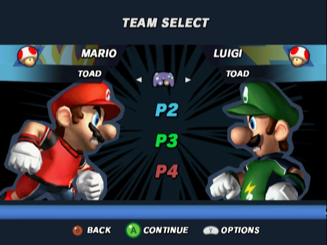
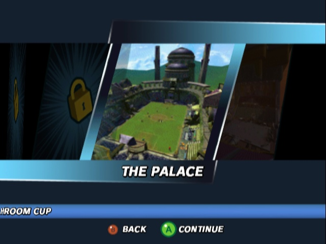
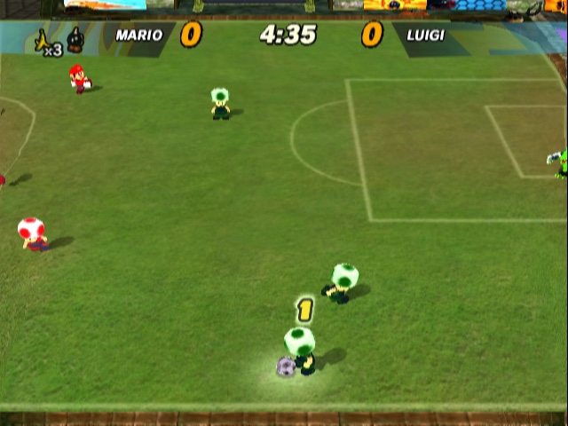
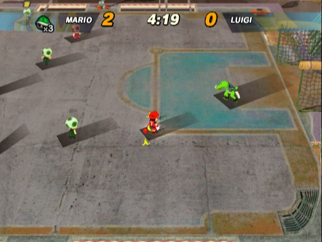

# GCGlue Strikers

This repository is a sanitized GCGlue project scaffold for Super Mario Strikers bring-up.

It does not include any commercial game image, extracted game assets, generated DOL byte arrays, memory dumps, FIFO sidecars, or local build outputs.

## What Is Included

- Strikers-specific `gcglue.toml` runtime configuration
- generated-host `src/main.cpp`
- CMake project files
- helper scripts for local regeneration, live play, and smoke verification
- status notes for the native recompilation/runtime path
- selected native progress screenshots

## Progress Screenshots

These captures come from local native GCGlue execution and GX preview output. Visual artifacts are expected; they are included to show current runtime progress.









## Required Local Inputs

Place your own legally obtained GameCube disc image here:

```text
assets/super-mario-strikers.nkit.iso
```

The `assets/` folder is ignored by git.

## Expected SDK Layout

Use this project from a checkout that can import the `gcglue` Python package and find the GCGlue runtime. The simplest layout is:

```text
workspace/
  gcglue/
  gcglue-strikers/
```

Then run commands from `gcglue-strikers/`.

## Commands

```sh
python3 -m gcglue validate gcglue.toml
python3 -m gcglue codegen gcglue.toml
python3 -m gcglue execute gcglue.toml --no-codegen --max-steps 120000000 --event-log --dump-gx-latest build/smoke/latest.ppm
python3 -m gcglue play gcglue.toml --no-codegen --event-log --port 8799 --live-dir build/live
```

Or use the helper scripts:

```sh
scripts/regenerate.sh
scripts/smoke.sh
scripts/play.sh
```

## Current Native Bring-Up Status

The local GCGlue runtime has reached real in-game Strikers match frames through native execution and GX replay. Remaining work is still active around hardware/device accuracy: CPU external interrupt delivery, DVD/thread scheduling, VI/GX presentation polish, DSP/audio behavior, and reducing Strikers-specific runtime shims.

This repo is intentionally a clean public scaffold for reproducing the work locally, not a distribution of the game.
